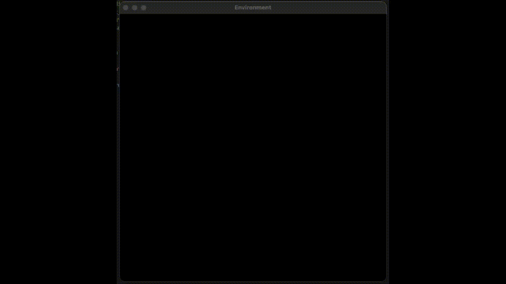
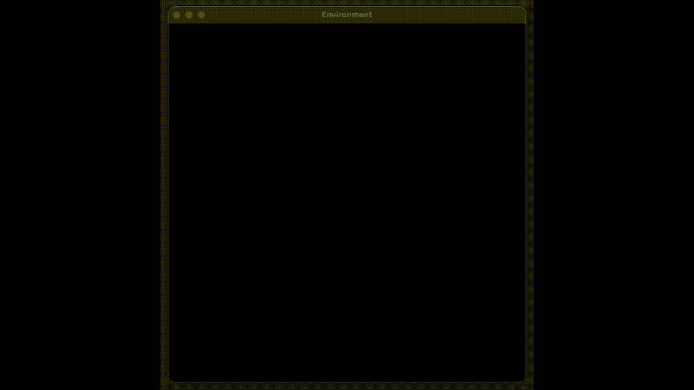
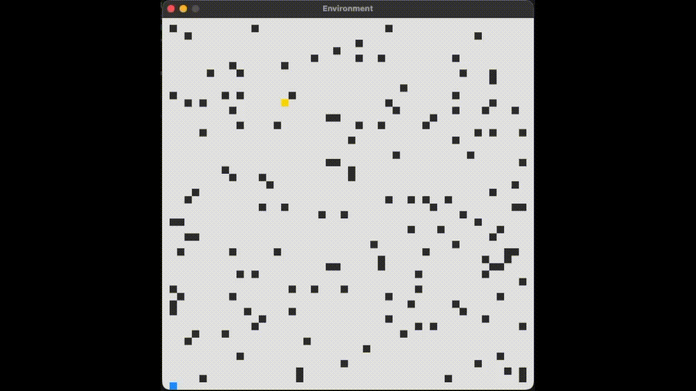
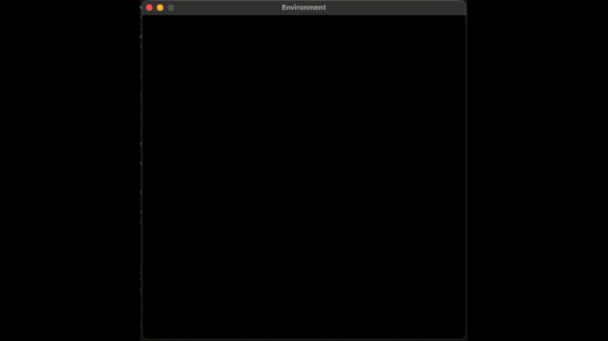
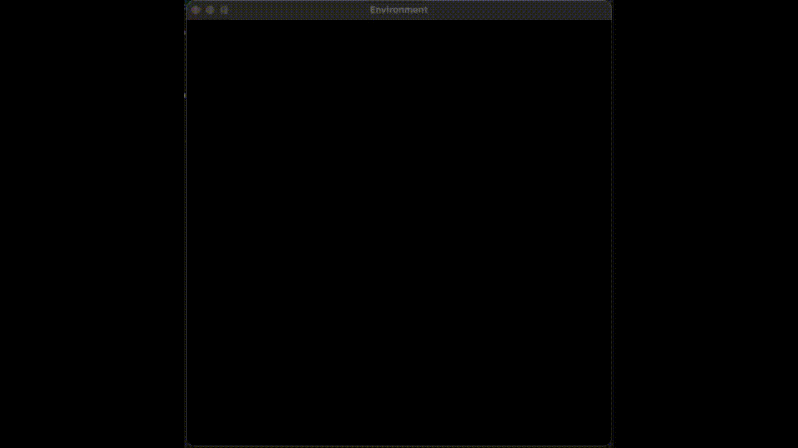

# Autonomous Agent Navigation with Evolutionary Algorithms and Reinforcement Learning

This repository contains a project focused on the development and evaluation of autonomous agents for navigation tasks in discrete simulated environments. The agents are trained using Evolutionary Algorithms with Novelty Search and Q-learning, and evaluated in two distinct scenarios: Maze and Lighthouse.

The main objective is to compare different control and learning strategies, analysing their performance, robustness, and generalisation capabilities under varying environmental conditions.


## Project Overview

Two environments are considered:

Maze

  - Grid-based environment with fixed obstacles
  - Three predefined difficulty levels
  - The agent must reach a goal position
  - The same three maps are used consistently during both training and evaluation

Lighthouse

  - Open environment with obstacles and a target location (lighthouse)
  - Multiple difficulty levels
  - Maps are partially or fully randomised
  - Final evaluation is performed on maps not used during training, to assess generalisation

## Agents

Three types of agents are implemented and evaluated:

Fixed Policy Agent

  - Uses a handcrafted, deterministic policy
  - Serves as a baseline for comparison

Q-learning Agent

  - Tabular reinforcement learning agent
  - Uses discretised observations
    
Evolved Agent

  - Controlled by a feedforward neural network
  - Network weights are evolved using a genetic algorithm with Novelty Search
  - No learning occurs during execution; behaviour is entirely defined by the evolved genome

## Observation Model

In both environments, agents receive a numerical observation vector with 12 features, including:

  - Eight distance sensors in fixed directions (N, S, E, W, NE, SE, SW, NW), returning normalised distances to the nearest obstacle within a given range
  - Additional environment-specific information:
  - Lighthouse: relative directional information towards the target.
  - Maze: normalised position, distance to the goal, and vertical displacement.

## Evolutionary Training

The evolved agent is trained using a genetic algorithm combined with Novelty Search, featuring:

  - Direct encoding of neural network weights
  - Tournament selection
  - Multiple crossover operators (uniform, one-point, blend)
  - Adaptive Gaussian mutation
  - Behaviour archive for novelty computation
  - Weighted combination of fitness and novelty, adjusted during training via curriculum learning

## Training Setup

Maze

  - Multi-environment training using the three fixed difficulty levels
  - Curriculum applied by gradually shifting the balance from exploration (novelty) to exploitation (fitness)
  - Champion agent evaluated separately for each difficulty

Lighthouse

  - Curriculum-based training using fixed, semi-random, and fully random maps
  - Final evaluation performed on unseen environments

## Evaluation

Agents are evaluated using a common protocol that disables learning and measures:

  - Success rate
  - Mean number of steps to reach the goal
  - Standard deviation of steps

Comparative plots are generated for each environment and difficulty level.


## Visual Results

### Maze Agent Behaviour

- Fixed Policy Agent

**Difficulty 0**  


**Difficulty 1**  


**Difficulty 2**  


- Evolved Agent

| Difficulty 0 | Difficulty 1 | Difficulty 2 |
|--------------|--------------|--------------|
|  |  |  |


### Lighthouse Agent Behaviour

- Fixed Agent


- Evolved Agent


- Q-learing Agent



## Project Structure

```
autonomous-navigation-evolutionary/
├── agents/              # Agent implementations
├── algorithms/          # Genetic algorithm and trainers
├── environments/        # Maze and Lighthouse environments
├── simulator/           # Episode execution engine
├── evaluation/          # Evaluation protocol and metrics
├── model/               # Neural network models
├── results/             # Training logs and plots
└── README.md
```

## Requirements

	•	Python 3.9+
	•	NumPy
	•	Matplotlib
	•	tqdm

## Running the Project

Train the evolutionary agent in the Maze environment:
```bash
python train_maze.py
```

Train the evolutionary agent in the Lighthouse environment:
```bash
python train_farol.py
```

Evaluate trained agents:
```bash
python -m evaluation.run_maze_eval
python -m evaluation.run_farol_eval
```

## Authors

- Nuno Neves
- Beatriz Nunes
- José Jarmela

## License

This project was developed as an academic work.


